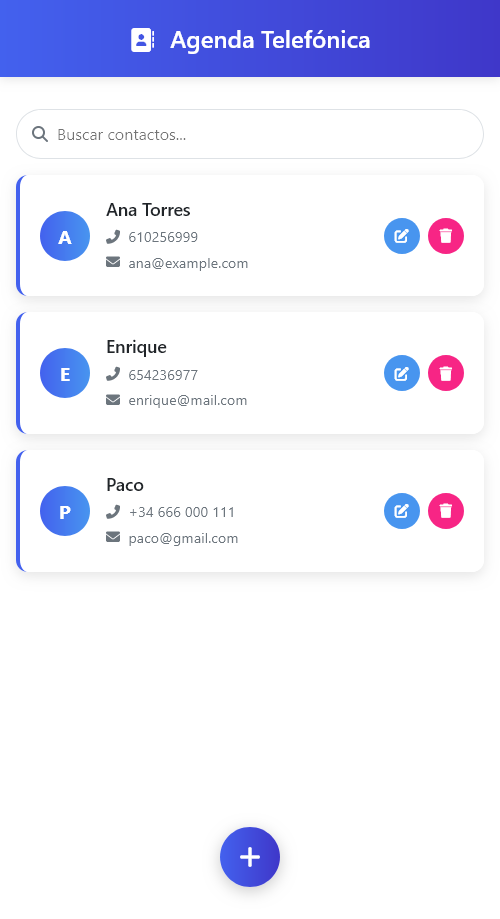

# Agenda Telefónica

## Descripción



**Agenda Telefónica** es una aplicación web que permite gestionar los contactos (nombre, email y teléfono). Las acciones que permite realizar son: ver contactos, buscar (por nombre o N.º de teléfono), añadir y eliminar. 

Para hacer la aplicación más escalable se ha dividido en dos partes:
 - **Backend** (carpeta `/api-v2`): Es una API RESTful creada en **PHP** nativo. Dicha API conecta con una base de datos **MySQL**
 - **Frontend** (carpeta `/web-app`): Contiene la aplicación Front que consume la API, desarrollada con **HTML**, **CSS** y **Javascript**

## Instrucciones de instalación

### 1. Requisitos técnicos previos:
Para ejecutar la aplicación necesitamos un servidor web con:
 - `PHP 8.4.0`
 - `MySQL 9.1.0`

También necesitaremos herramientas como **Git**

### 2. Instalación:

### 2.1 Instalación de git:

Para poder descargar el repositorio necesitamos tener instalado GIT. Podemos descargarlo en este enlace:

https://git-scm.com/install/


### 2.3. Instalación de los servidores:

Idealmente, esto debería hacerse con Docker, pero en este caso, para simplificar el desarrollo haremos una instalación en local de wamp (si estás en Windows) o mamp (si estás en mac).

Puedes descargarlos directamente en:

https://sourceforge.net/projects/wampserver/files/WampServer%203/WampServer%203.0.0/wampserver3.3.7_x64.exe/download

https://www.mamp.info/en/release-notes/mac/

Una vez instalados arrancaremos los servidores. 

### 2.4. Descarga el repositorio:
Accede a la carpeta raíz de proyectos del servidor instalado (suele ser `C:\wamp64\www` para Wamp y `/Applications/MAMP/htdocs/` para Mamp).

Dentro de esa carpeta, descarga el repositorio con el comando:
```
git clone https://github.com/JuanRodriguez91/agenda-telefonica.git
```

Selecciona la rama `feature/v2` con el siguiente comando:
```
git checkout feature/v2
```


### 2.5. Instalación de la base de datos:
Para instalar la base de datos, primero tenemos que tener un servidor de bases de datos instalado, configurado (Lo cual se explica en el punto 2.3.)

Una vez instalado el servidor, lanza los comandos:
```
cd api-v2
```
```
cp .env.example .env
```

En el fichero `.env` que se acaba de crear, cambia la configuración de la base de datos para que coincida con la de tu servidor:

```
DB_CONNECTION=mysql
DB_HOST=localhost
DB_PORT=3306
DB_DATABASE=agenda_telefonica
DB_USERNAME=(tu usuario)
DB_PASSWORD=(tu contraseña)
```

Una vez configurada la conexión, crearemos la base de datos y las tablas ejecutando [agenda_telefonica.sql](agenda_telefonica.sql) en un cliente de bases de datos como phpMyAdmin, MySQL Workbench, etc.


### 2.6. Ejecutar aplicación

Antes de ejecutar la aplicación, podemos comprobar si la conexión a la base de datos es correcta visitando este enlace:

http://localhost/agenda-telefonica/api-v2/public/

Si hemos seguido los pasos anteriores correctamente, podremos ejecutar la aplicación desde la URL:

http://localhost/agenda-telefonica/web-app/

_NOTA: Esta URL será válida siempre que hayamos descargado el repositorio en el directorio raíz de nuestro servidor web_

## 3. Credenciales

Para esta prueba hemos creado un usuario con las siguientes credenciales:

**Usuario:**
```
admin@admin.com
```

**Contraseña:**
```
admin123
```

